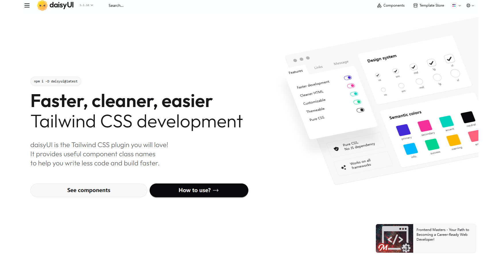
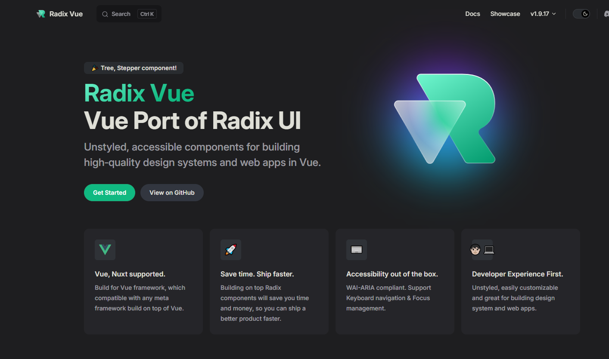
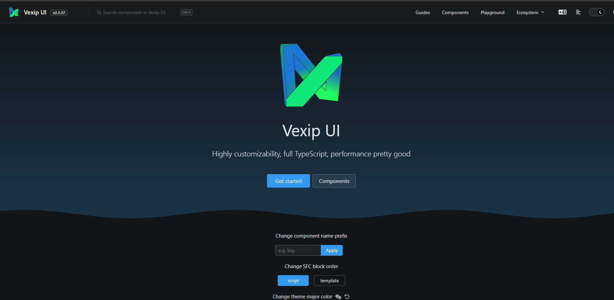
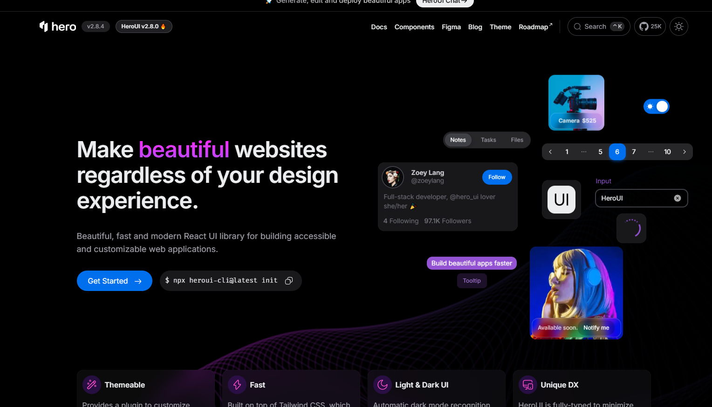
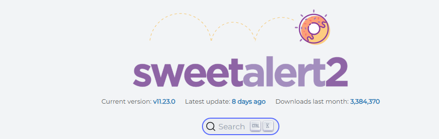
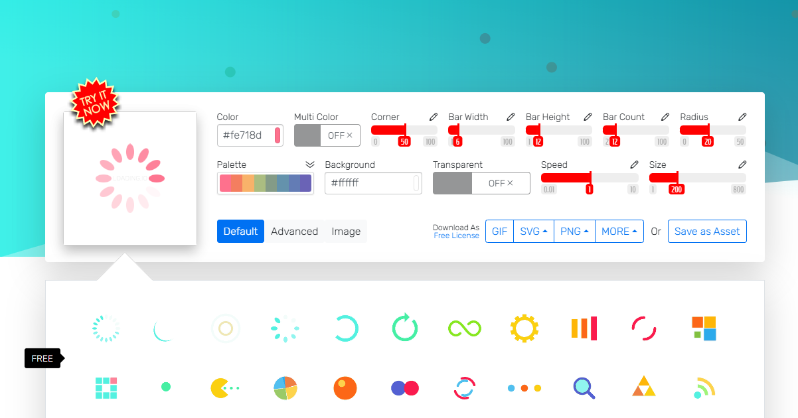
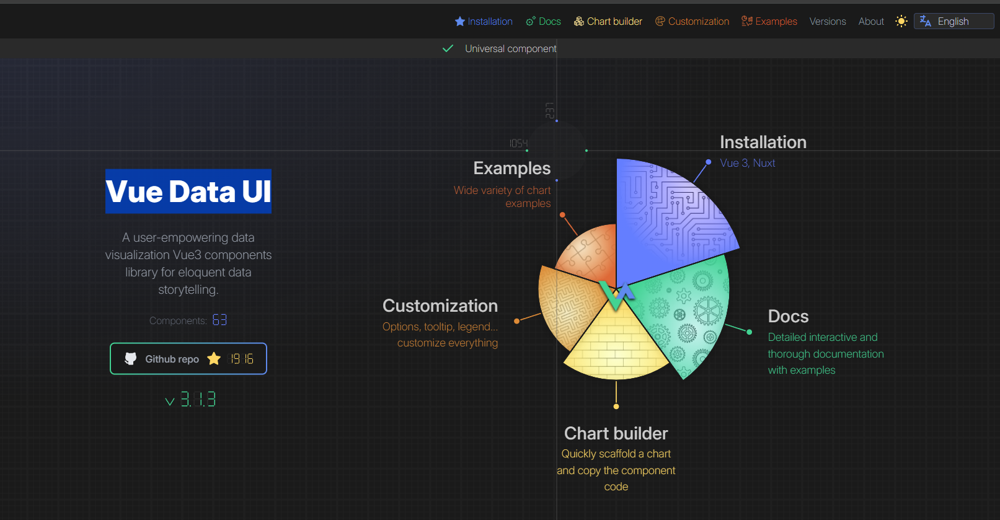
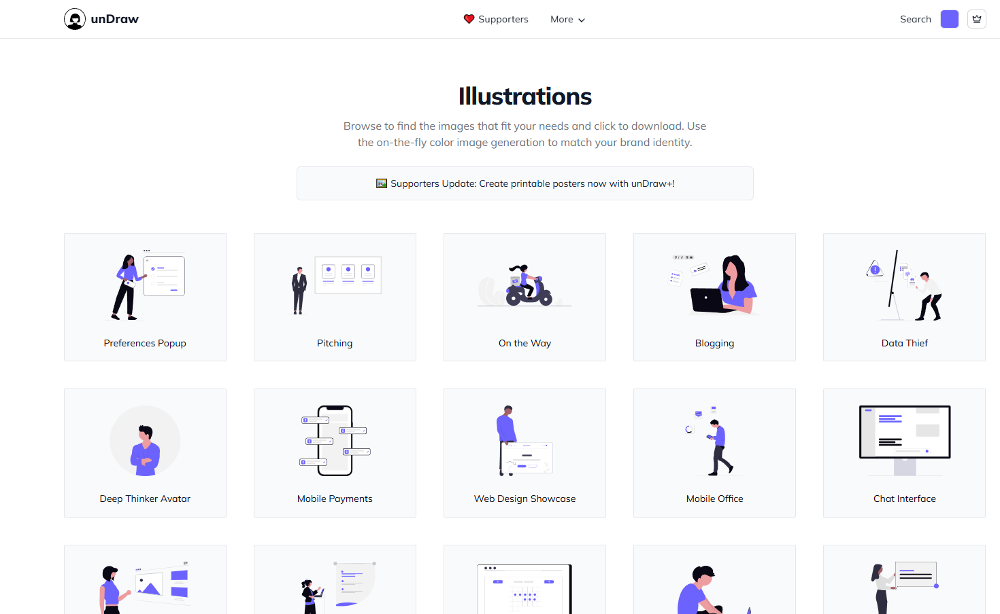
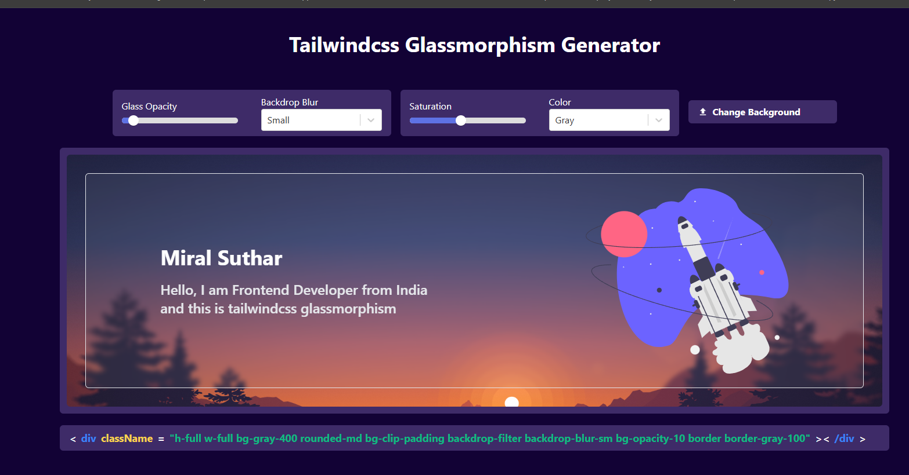

`若迷尘亲选工具库`带你少走很多弯路，go go go!(推荐指数由高往低)
<!-- more -->

## HTML+CDN最佳食用组合
### JS
[托拽工具库](https://sortablejs.github.io/Sortable/)
[highlight.js高亮](https://highlightjs.org/#usage)
[脚手架（Web应用）](https://rsbuild.rs/zh/)
[clipboardjs](https://clipboardjs.com/)剪切板实现（但我觉得原生实现也行）

### UI
[UIkit](https://getuikit.com/)
[Layui](https://layui.dev/)

## UI

### 多技术
[shadcn](https://ui.shadcn.com/) 牛 用过都说好 虽然麻烦但高级感十足
[heroui](https://www.heroui.com/)
[TuniaoUI 组件库](https://vue3.tuniaokj.com/)Vue3 Typescript Uniapp版本
[mambaui](https://mambaui.com/)这个用得也少 有点杂

### Taiwind CSS

[daisyui](https://daisyui.com/)

[skeleton](https://www.skeleton.dev/)

[tailgrids](https://tailgrids.com/)
[tailawesome](https://www.tailawesome.com/)发现Tailwind 模板和UI 工具

[Preline UI](https://preline.co/index.html)

[flowbite](https://flowbite.com/)

### Vue
[Inspira UI](https://inspira-ui.com/docs/)我们Vue自己的炫酷
[Radix Vue](https://www.radix-vue.com/)

[vexipui](https://www.vexipui.com/en-US/)年轻产物 可以支持一下

### React
[aceternity](https://ui.aceternity.com/)那很无敌了 想要炫酷秒选
[cult ui](https://www.cult-ui.com/)我与一楼不分伯仲
[mui](https://mui.com/)没怎么用过脑瓜子疼 感觉很厉害

### Nuxt
[https://ui.nuxt.com/](https://ui.nuxt.com/?utm_source=nuxt_website&utm_medium=modules)官方没得说

### Next

### React Native
[nativewind](https://www.nativewind.dev/)应该很牛吧 没机会用 +tailwindcsss

## AI UI
### Vue
[MateChat](https://matechat.gitcode.com/)用过试了一下 

## 弹窗
有人问我 问什么要分享弹窗 UI 基本上不都涵盖了吗 我只能说 你们 没有体会到我们这些原始牛马的经验 不知道什么叫做HTML纯原生的痛苦

[SweetAlert2](https://sweetalert2.github.io/#usage)简单的可以用 太过花里胡哨就算了 也可以用于模态框

## 加载图片制作
[loading](https://loading.io/)nono的

## 异步状态管理
[tanstack](https://tanstack.com/query/latest)
[Zustand(React)](https://zustand-demo.pmnd.rs/)
[Pinia(Vue)](https://pinia.vuejs.org/)

## 图表
### Vue
[Vue Data UI](https://vue-data-ui.graphieros.com/)很厉害 也是没机会用

## 素材
### 头像
[avatar-placeholde](https://avatar-placeholder.iran.liara.run/)

### 插图
[unDraw](https://undraw.co/illustrations)

## 图片素材
[pexels](https://www.pexels.com/zh-cn/)

## 大模型
[讯飞星火大模型](https://xinghuo.xfyun.cn/)

## 播放器
[vue-aplayer](https://aplayer.netlify.app/docs/)A beautiful HTML5 music player for Vue.js

## logo获取
[logoipsum](https://logoipsum.com/)直接CVD
[logto](https://auth.logto.io/)

## 快递物流

[快递100](https://api.kuaidi100.com/home/)

## 云托管
[unicloud]()
[Sealos](https://bja.sealos.run/signin)
[Firebase](https://firebase.google.com/

## 颜色选择
[hypercolor](https://hypercolor.dev/)对Tailwindcss开发者友好

## 图标
[heroicons](https://heroicons.com/)
[iconify](https://icon-sets.iconify.design/)

## 日常工具
[压缩图片](https://tinypng.com/)
[消除背景工具](https://www.remove.bg/zh/upload)

[测试配色平台](https://uicolors.app/generate/9ce3db) 很不错 但是老是忘记用 

### 需要代码能力
[农历库Lunisolar](https://lunisolar.js.org/guide/quickStart.html)
[Tailwindcss Glassmorphism Generator](https://tailwindcss-glassmorphism.vercel.app/)毛玻璃神器
[Fancyapps UI](https://fancyapps.com/)很厉害 场景一般用在多图展示 轮播用这个很香
[Isotope](https://isotope.metafizzy.co/sorting)排序的 HTML可以用的多吧
[三角形生成代码](https://www.cssportal.com/css-triangle-generator/)不错 对于奇葩需求来说很合理了

## 模板
[w3layouts](https://w3layouts.com/)
[templatemo](https://templatemo.com/)
[mineadmin](https://www.mineadmin.com/)
