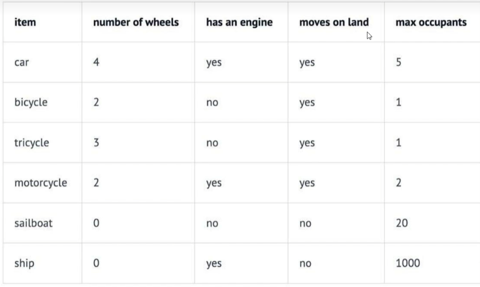
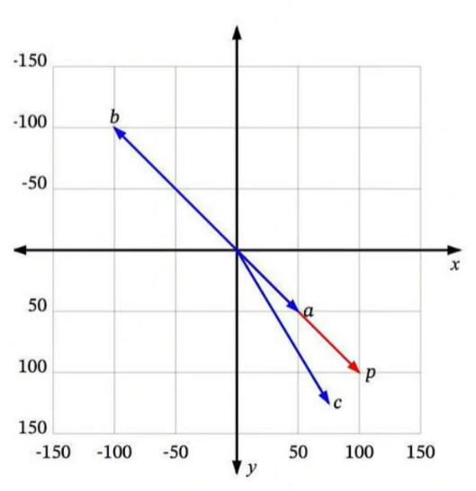
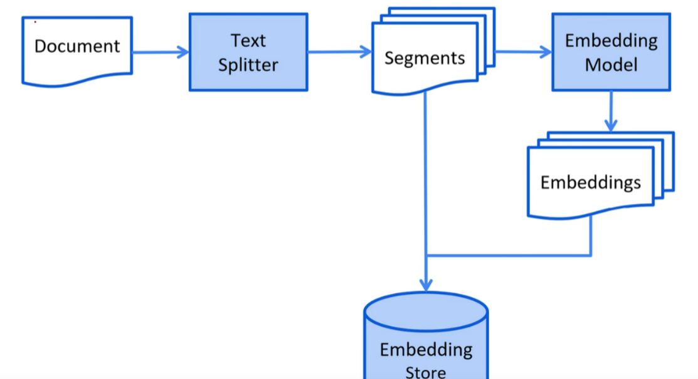
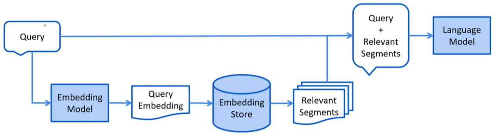
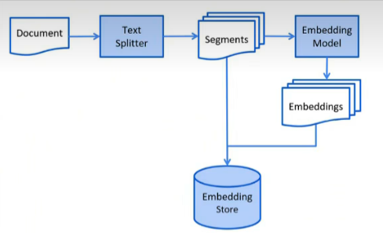
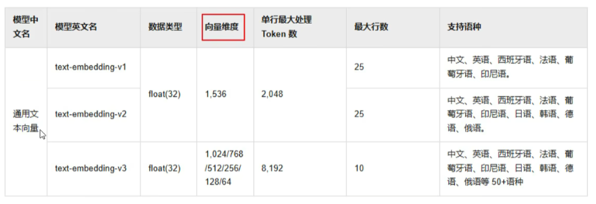

Java整合`LangChain4j`实现AI医疗助手
<!-- more -->

[应用](https://www.bilibili.com/video/BV1cpLTz1EVp?spm_id_from=333.788.player.switch&vd_source=f55a0f8a29f580217584940a7bb9606b&p=17)

### 2.1引入依赖
```xml
<dependency>
    <groupId>dev.langchain4j</groupId>
    <artifactId>langchain4j-spring-boot-starter</artifactId>
</dependency>
```

### 2.2创建接口
```java
package com.atguigu.java.ai.langchain4j.assistant;

public interface Assistant {
    String chat(String userMessage);
}
```

### 2.3测试用例
```java
@SpringBootTest
public class AIServiceTest{

    @Autowired
    private QwenChatModel qwenChatModel;

    @Test
    public void testChat(){
      //创建AIService
      Assistant assistant = AiServices.create(Assistant.class,qwenChatModel);
      //调用service接口
      String answer = assistant.chat("Hello");
      System.out.println(answer);
    }
}
```

### 2.4 @AiService
也可以在`Assistant`接口上添加@AiService注解
```java
@AiService(wiringMode = EXPLICIT,chatModel = 'qwenChatModel')
public interface Assistant{
    String chat(String userMessage);
}
```
测试用例中，我们可以直接注入Assistant对象
```java
@Autowired
private Assistant assistant;

@Test
public void testAssistant(){
    String answer = assistant.chat("Hello");
    System.out.println(answer);
}
```

### 2.5 工作原理
AiService会组装Assistant接口以及其他组件，并使用反射机制创建一个实现Assistant接口的代理对象。这个代理对象会处理输入和输出的所有转换工作。在这个例子中chat方法的输入是一个字符串，但是大模型需要一个UserMessage对象。所以，这个代理对象会将这个字符串转换为UserMessage，并调用聊天语言模型。chat方法的输出类型也是字符串，但是大模型返回的是AiMessage对象，代理对象会将其转换为字符串。

简单理解就是：代理对象的作用是输入转换和输出转换

## 四、聊天记忆 Chat memory

### 1.测试对话是否有记忆

```java
package com.atguigu.java.ai.langchain4j;

@SpringBootTest
public class ChatMemoryTest{

  @Autowired
  private Assistant assistant;

  @Test
  public void testChatMemory(){

      String answer1 = assistant.chat("我是缓缓");
      System.out.println(answer1);

      String answer2 = assistant.chat("我是谁");
      System.out.println(answer2);
  }
}
```

很显然 目前的接入方式 大模型是没有记忆的。

### 2.聊天记忆的简单实现
可以使用下面的方式实现对话记忆
```java
@Autowired
private QwenChatModel qwenChatModel;
@Test
public void testChatMemory2(){

    //第一轮对话
    UserMessage userMessage1 = UserMessage.userMessage("我是缓缓");
    ChatResponse chatResponse1 = qwenChatModel.chat(userMessage1);
    AiMessage aiMessage1 = chatResponse1.aiMessage();
    //输出大语言模型的回复
    System.out.println(aiMessage1.text());

    //第二轮对话
    UserMessage userMessage2 = UserMessage.userMessage("你知道我是谁吗");
    ChatResponse chatResponse2 = qwenChatModel.chat(Arrays.asList(userMessage1,aiMessage1,userMessage2));
    AiMessage aiMessage2 = chatResponse2.aiMessage();

    //输出大预言模型的回复
    System.out.println(aiMessage2.text());  
}
```

### 3.使用ChatMemory实现聊天记忆
使用AIService可以封装多轮对话的复杂性，使聊天记忆功能的实现变得简单
```java
@Test
public void testChatMemory3(){

    //创建chatMemory
    MessageWindowChatMemory chatMemory = MessageWindowChatMemory.withMaxMessages(10);

    //创建AIService
    Assistant assistant = AiServices
    .builder(Assistant.class)
    .chatLanguageModel(qwenChatModel)
    .chatMemory(chatMemory)
    .build()
    //调用service的接口
    String answer1 = assistant.chat("我是缓缓");
    String answer2 = assistant.chat("我是谁")
    System.out.println(asnwer2);
}
```

## 4.使用AiService实现聊天记忆
### 4.1 创建记忆对话智能体
当AIService由多个组件（大模型，聊天记忆，等）组成的时候，我们就饿可以称它为智能体了


## 5.隔离聊天记忆
为每个用户的新聊天或者不同的用户区分聊天记忆
### 5.1创建记忆隔离对话智能体
```java
package com.atguigu.java.ai.langchain4j.assistant;

@AiService(
    wiringMode = EXPLICIT,
    chatModel = 'qwenChatModel',
    chatMemory = 'chatMemory',
    chatMemoryProvider = 'chatMemoryProvider'
)
public interface SeparateChatAssistant{
  /**
   * 分离聊太难记录
   * @param memoryId 聊天id
   * @param userMessage 用户消息
   * @return
   */
  String chat(@MemoryId int memoryId,@UserMessage String userMessage);
}
```

### 5.2配置chatMemoryProvider
```java
package com.atguigu.java.ai.langchain4j.config;

@Configuration
public class SeparateChatAssistantConfig{
    
    @Bean
    public ChatMemoryProvider chatMemoryProvider(){
       
       return memoryId -> MessageWindowChatMemory
       .builder()
       .id(memoryId)
       .maxMessages(10)
       .chatMemoryStore(new InMemoryChatMemoryStore())
       .build();
    }
}
```

```java
  @Autowired
  private SeparateChatAssistant separateChatAssistant;
  
  @Test
  public void testChatMemory5(){
      String answer1 = separateChatAssistant.chat(1,"我是张三");
      String answer2 = separateChatAssistant.chat(1,"我是谁");
      String answer3 = separateChatAssistant.chat(2,"我是张三");
  }
```

### 5.3持久化聊天类
`store`包
```java
public class MongoChatMemoryStore implements ChatMemoryStore{

  @Autowired
  private MongoTemplate mongoTemplate;


  @Override
  public List<ChatMessage> getMessages(Object memoryId){
    Criteria criteria = Criteria.where("memoryId").is(memoryId);
    Query query = new Query(criteria);

    ChatMessages chatMessages = mongoTemplate.findOne(query,ChatMessages.class);
    if(chatMessages == null){
      return new LinkedList<>();
    }
    String contentJson = chatMessages.getContent();

    return ChatMessageDeserializer.messagesFromJson(contentJson);
  }

  @Override 
  public void updateMessages(Object memoryId,List<ChatMessage> list){
    Cirteria criteria = Criteria.where("memoryId").is(memoryId);
    Query query = new Query(criteria);
    Update update = new Update();

    update.set("content",ChatMessageSerializer.messagesToJson(list));

    //修改或新增
    mongoTemplate.upsert(query,update,ChatMessages.class);
  }

  @Override
  public void deleteMessages(Object memoryId){
    Criteria criteria = Criteria.where("memoryId").is(memoryId);
    Query query = new Query(criteria);
    mongoTemplate.remove(query,chatMessages.class);
  }

}
```

### 5.4测试
修改`SeparateChatAssistantConfig`
```java
  @Autowired
  private MongoChatMemoryStore mongoChatMemoryStore;

  ...
  ...
  .chatMemoryStore(mongoChatMemoryStore);
```

# 六、提示词
## 1. 系统提示词
`@SystemMessage`设定角色，塑造AI助手的专业身份，明确助手的能力范围
### 1.1 配置@SystemMessage
在SeparateChatAssistant类的chat方法上添加@SystemMessage注解
```java
@SystemMessage("你是我的好朋友,请用东北话回答问题")//系统消息提示框
String chat(@MemoryId int memoryId,@UserMessage String userMessage);
```
`@SystemMessage`的内容将在后台转换为`SystemMessage`对象，并与`UserMessage`一起发送给大预言模型（LLM）。
SystemMessage的内容只会发给大模型一次。
如果你修改了SystemMessage的内容,新的SystemMessage会被发送给大模型，之前的聊天记录会失效。

### 1.2 从资源中加载提示模板
`@SystemMessage`注解还可以从资源中加载提示模板：
```java
@SystemMessage(fromResource = "my.txt")
String chat(@MemoryId int memoryId,@UserMessage String userMessage);
```
my.txt
```txt
你是我的好朋友...
```
{{current_date}}表示当前日期
```txt
你是我的好朋友...
今天是{{current_date}}.
```

## 2. 用户提示词模板
`@UserMessage`：获取用户输入
### 2.1配置@UserMessage
在`MemoryChatAssistant`的`chat`方法中添加注解
```java
@UserMessage("你是我的好朋友，{{it}}")//{{it}}这里表示唯一的参数的占位符
String chat(String message);
```
### 2.2 测试
```java
@Autowired
private MemoryChatAssistant memoryChatAsiistant;

@Test
public void testUserMessage(){
  String answer = memoryChatAssistant.chat("我是缓缓");
}
```

## 3.置顶参数名称
### 3.1 配置@V
`@V`明确置顶传递的参数名称
```java
@UserMessage("你是我的好朋友,{{message}}")
```
### 3.2 多个参数的情况
如果有两个或两个以上的参数，我们必须要用`@V`，在`SeparateChatAssistant`中定义方法`chat2`
```java
@UserMessage("你是我的好朋友{{message}}")
String chat2(@MemoryId int memoryId, @V("message") String userMessage);
```
测试：@UserMessage中的内容每次都会被和用户问题组织在一起发送给大模型
```java
@Test
public void testV(){
  String answer1 = separateChatAssistant.chat2(1,"我是缓缓");
  String answer2 = separateChatAssistant.chat2(1,"我是谁");
}
```

### 3.3 @SystemMessage和@V
也可以将`@SystemMessage`和`@V`结合使用
在`SeparateChatAssistant`中添加方法chat3
```java
@SystemMessage(fromResource = 'my.txt')
String chat3(
    @MemoryId int memoryId,
    @UserMessage String userMessage,
    @V("username") String username,
    @V("age") int age
)
```
创建提示词模板my.txt，添加占位符
```txt
你是我的好朋友，我是{{username}}，我的年龄是{{age}}今天是{{current_date}}
```
测试：
```java
@Test
public void testUserInfo(){
  String answer = separateChatAssistant.chat3(1,"我是谁我多大了","翠花",18);
}
```

# 七、项目实战-创建智能体
这部分我们实现智能体基本聊天功能，包含聊天记忆、聊天记忆持久化、提示词
## 1.创建
创建Agent
```java
@AiService(
    wiringMode = EXPLICIT,
    chatModel = 'qwenChatModel',
    chatMemoryProvider = "chatMemoryProvider"
)
public interface Agent{
    @SystemMessage(fromResource = 'template.txt')
    String chat(@MemoryId Long memoryIid, @UserMessage String userMessage);
}
```
## 2.提示词模板
template.txt
```txt
你是一一个训练有素的医疗顾问和医疗伴诊助手。
你态度友好、礼貌且言辞简洁。
1、请仅在用户发起第一次会话时， 和用户打个招呼，并介绍你是谁。
2、作为- -个训练有素的医疗顾问:
请基于当前临床实践和研究。针对患者提出的特定健康问题，提供详细、准确且实用的医疗建议。请同时考虑可能的病因、诊断流程、治疗方案以及预防措施，并给出在不同情域
3、作为医疗伴诊助手，你可以回答用户就医流程中的相关问题，主要包含以下功能:
AI分导诊:根据忠者的病情和就医需求，智能推荐最合适的科室。
AI挂号助手:实现智能查询是否有挂号号源服务:实现智能预约挂号服务:实现智能取消挂号服务。
4、你必须遵守的规则如下:
在获取挂号预约详情或取消挂号预约之前，你必须确保自己知晓用户的姓名(必选)、身份证号(必选)、预约科室(必选)、预约日期(必选，格式举例: 2025-04-14) 、1
当被问到其他领域的咨询时，要表示歉意并说明你无法在这方面提供帮助。
5、请在回答的结果中适当包含一些轻 松可爱的图标和表情。
6、今天是{{current_date}}.
```
Controller.java
```java
@Tag(name = "智能体")
@RestController
@RequestMapping("/agent")
public class Controller{
   
   @Autowired
   private Agent agent;

   @PostMapping("/chat")
   public String chat(@RequestBody ChatForm chatForm){
      return agent.chat(chatForm.getMemoryId(), chatForm.getMessage());
   }
}
```

# 八、Function Calling函数调用
`Function Calling 函数调用`也叫`Tools 工具`
## 1.入门案例
例如，大语言模型本身并擅长数学运算。如果应用场景中偶尔会涉及到数学计算，我们可以为他提供一个“数学工具”。当我们提出问题时，大语言模型会判断是否使用某个工具。
### 1.1 创建工具类
用`@Tool`注解的方法：
- 既可以是静态的，也可以是非静态的；
- 可以具有肉疼和可见性（共有、私有等）。
```java
@Component
public class CalculatorTools{
    @Tool
    double sum(double a,double b){
      System.out.println("调用加法运算");
      return a+b;
    }
}
```
### 1.2 配置工具类
在SeparateChatAssistant中添加tools属性配置
```java
@AiService{
    wiringMode = EXPLICIT,
    chatModel = "qwenChatModel",
    tools = "calculatorTools" //配置tools
}
```

### 1.3 测试工具类
```java
public class ToolsTest{

    @Autowired
    private SeparateChatAssistant separateAssistant;

    @Test
    public void testCalculatorTools(){

        String answer = separateChatAssistant.chat(1,"1+2等于几，34534的平法根是多少？");
        //答案：3，123213
    }
}
```
测试后可以查看持久化存储SYSTEM、USER、AI以及Tools的消息，分析tools的调用流程：
```txt
Request:
\- messages:
  \- SystemMessage:
    \- text: 系统定义AI角色
  \- UserMessage:
    \- text: 用户提问
  \- AIMessage:
    \- toolExecutionRequests:
      \- ai获取提问信息组织参数调用工具方法
  \- ToolExecutionResultMessage:
    \- text: 工具方法执行

Reponse :
\- AiMessage:
  \- text: 根据工具方法的执行ai再次组织结果返回
```

## 2. @Tool注解的可选字段
`@Tool`注解有两个可选字段：
- `name(工具名称)`：工具的名称。如果未提供该字段，方法名会作为工具名。
- `value(工具描述)`：工具的描述信息。
根据工具的不同，即使没有任何描述，大语言模型可能也能很好地理解它(例如，add(a,b)就很直观),但通常最好提供清晰且具有意义的名称和描述。这样，大语言模型就能获得更多信息，以决定是否调用给定的工具以及如何调用。

## 3. @P注解
方法参数可以选择使用`@P`注解进行标注。
`@P`注解有两个字段：
- `value`：参数的描述信息，这是必填的字段。
- `required：表示该参数是否为必须项，默认值为``true`，此为可选字段。

## 4.@ToolMemoryId
如果你的AIService方法中有一个参数使用@MemoryId注解，那么你也可以使用@ToolMemoryId注解@Tool方法中的一个参数。提供给AIService方法的值将自动传递给@Tool方法。如果你有多个用户，或每个用户有多个聊天记忆，并且希望在@Tool方法中对它们进行区分，那么这个功能会很有用。
```java
@Tool(name = '加法', value = '返回两个参数相加之和')
double sum(
  @ToolMemoryId int memoryId,
  @P(value="加数1",required = true) double a,
  @P(value = "加数2",required = true) double b
){
  ...
}
```

# 九、优化
## 1.预约业务的实现
实现查询订单、预约订单、取消订单的功能
### 1.1创建MySQL数据库
```sql
CREATE DATABASE `agent`;
USE 'agent';
CREATE TABLE `appointment`(
  `id` BIGINT NOT NULL AUTO_INCREMENT,
  `username` VARCHAR(50) NOT NULL,
  `id_card` VARCHAR(18) NOT NULL,
  `department` VARCHAR(50) NOT NULL,
  `date` VARCHAR(10) NOT NULL,
  `time` VARCHAR(10) NOT NULL,
  `doctor_name` VARCHAR(50) DEFAULT NULL<<
  PRIMARY KEY (`id`)
)
```
### 1.2 引入依赖
```xml
<!-- Mysql Connector -->
<dependency>
  <groupId>com.mysql</groupId>
  <artifactId>mysql-connector-j</artifactId>
</dependency>
<!-- mybatis-plus持久层 -->
<dependency>
 <groupId>com.baomidou</groupId>
  <artifactId>mybatis-plus-spring-boot3-starter</artifactId>
  <version>${mybatis-plus.version}</version>
</dependency>
```
### 1.3配置数据库连接
application.properties
```yaml
#基本数据源配置
spring:
  datasource:
    url: jdbc:mysql://localhost:3306/guigu?useUnicode=true&charactreEncoding=UTF-8&serverTimezone=Asia/Shanghai&useSSL=false
    username: root
    password: 123456
    driver-class-name: com.mysql.cj.jdbc.Driver

#开启SQL日志打印
mybatis-plus:
  configuration:
    log-impl: org.apache.ibatis.logging.stdout.StdOutImpl
```

这里可以使用MybatisX插件
[地址](https://baomidou.com/en/guides/mybatis-x/)
### 1.4创建实体类
```java
@Data
@AllArgsContructor
@NoArgsConstructor
public class Appointment{

  @TableId(type = IdType.AUTO)
  private Long id;
  private String username;
  private String idCard;
  private String department;
  private String date;
  private String time;
  private String doctorName;
}
```
### 1.5 Mapper
接口
```java
@Mapper
public interface AppointmentMapper extends BaseMapper<Appointment>{
}
```
xml:在reousrces下创建mapper目录

## 2.Tools
### 2.1创建Tools
```java
@Component
public class AppointmentTools{
  
  @Autowired
  private AppointmentService appointService;

  @Tool(name = "预约挂号", value = "根据参数，先执行工具方法queryDepartment查询是否可预约，并直接给用户回答是否可预约，并让用户确认所有预约信息，用户确认后在进行预约。")
  public String bookAppointment(Appointment appointment){

    //查找数据库中是否包含对应的预约记录
    Appointment appointmentDB = appointmentService.getOne(appointment);

    if(appointmentDB == null){
      appointment.setId(null);//防止大模型幻觉设置了id
      if(appointmentService.save(appointment)){
        return "预约成功，并发挥预约详情";
      }else{
         return "预约失败";
      }
    }

    return "您在相同的科室和时间已有预约";
  }

  @Tool(name = "取消预约挂号", value = "根据参数，查询预约是否存在，如果存在则删除预约记录并返回取消预约成功，否则返回取消预约失败")
  public String cancelAppointment(Appointment appointment){

    //查找数据库中是否包含对应的预约记录
    Appointment appointmentDB = appointmentService.getOne(appointment);

    if(appointmentDB != null){
      if(appointmentService.removeById(appointmentDB.getId())){
        return "取消预约成功";
      }else{
         return "取消预约失败";
      }
    }

    return "您没有预约记录，请核对预约科室和时间";
  }
}
```
# 十、检索增强生成RAG
## 1.如何让大模型回答专业领域的知识
LLM的只是仅限于它所训练的数据。如果你想让LLM了解特定领域的知识或转有数据，你可以：
- `使用RAG`
- 使用你的数据微调LLM
- 结合RAG和微调

### 1.1微调大模型
在现有大模型的基础上，使用小规模的特定任务数据进行再次训练，调整模型参数，让模型更精确地处理特定领域或任务的数据。更新需重新训练，计算资源和时间成本成本高。
- 优点：一次会话只需一次模型调用，速度快，在特定任务上性能更高，准确性也更高。
- 缺点：知识更新不及时，模型训练成本高、训练周期长。
- 应用场景：适合知识库稳定、对生产内容准确性和风格要求高的场景，如对上下文理解和语言生成质量要求高的文学创作、专业文档生成等。

### 1.2RAG
Retrieval-AUgmented Generation检索增强生成
将原始问题以及提示词信息发送给大语言模型之前，先通过外部知识库检索相关信息，然后将检索结果和原始问题一起发送给大模型，大模型依据外部知识库再结合自身的训练数据，组织自然语言回答问题。通过这种方式，大语言模型可以获取到特定领域的相关信息，并能够利用这些信息进行回复。
- 优点：数据存储在外部知识库，可以实时更新，不依赖对模型自身的训练，成本更低。
- 缺点：需要两次查询：先查询数据库，然后再查询大模型，性能不如微调大模型。

### 1.3、RAG常用方法
- `全文(关键词)搜索`，这种方法通过将问题和提示词中的关键词与知识库文档数据库进行匹配来搜索文档，根据这些关键词在每个文档中的出现频率和相关性对搜索结果进行排序。
- `向量搜索` ，也被称为“语义搜索”。文本通过`嵌入模型`被转换为`数字向量`。然后，它根据査询向量与文档向量之间的余弦相似度或其他相似性/距离度量来查找和排序文档，从而捕捉更深层次的语义含义。
- `混合搜索`，结合多种搜索方法（例如，全文搜索+向量搜索）通常可以提高搜索的效果。

## 2、向量搜索 vector search
### 2.1、向量 Vectors
可以将向量理解为从空间中的一个点到另一个点的移动。例如，在下图中，我们可以看到一些二维空间中的向量:

::: tip  
a是一个从 (100,50) 到 (-50,-50)的向量，b 是一个从(0,0) 到 (100,-50) 的向量。
:::

### 2.2、维度 Dimensions

例如，在一个交通工具数据集中，我们可以定义四个维度:“轮子数量”、“是否有发动机”、“是否可以在地上开动"和“最大乘客数"。然后我们可以将一些车辆


因此，我们的汽车car向量将是 (4,yes,yes,5)，或者用数值表示为 (4,1,1,5)(将 yes 设为 1，no 设为 0)
向量的每个维度代表数据的不同特性，维度越多对事务的描述越精确，我们可以使用“是否有翅膀”、“是否使用柴油”、“最高速度”、“平均重量”、“价格"等更多的维度信息。

### 2.3、相似度 Similarity
如果用户搜索“轿车Car"，你希望能够返回所有与“汽车automobi1e"和“车辆vehic1e"等信息相关的结果。向量搜索就是实现这个目标的一种方法。
如何确定哪些是最相似的?
每个向量都有一个长度和方向。例如，在这个图中，和a指向相同的方向，但长度不同。p和b正好指向相反的方向，但有相同的长度。然后还有c，长厦比p短一点，方向不完全相同，但很接近。


那么，哪一个最接近p呢?
如果“相似"仅仅意味着指向相似的方向，那么a是最接近p的。接下来是c。b是最不相似的，因为它正好指向与,相反的方向。如果“相似"仅仅意味着相似的长度，那么b是最接近p的(因为它有相同的长度)，接下来是c，然后是 a。由于向量通常用于描述语义意义，仅仅看长度通常无法满处需求。`大多数相似度测量要么仅依赖于方向，要么同时考虑方向和大小。`

### 2.4、`相似度测量 Measures of similarity`
相似度测量即相似度计算。四种常见的向量相似度计算方法(这里不展开讨论):
- 欧几里得距离 Euclidean distance
- 曼哈顿距离 Manhattan distance
- 点积 Dot product
- 余弦相似度 Cosine similarity

## 3.RAG的过程
RAG过程分为2个不同的阶段：索引和检索。
### 3.1索引阶段
在索引阶段，对知识库文档进行预处理，可实现检索阶段的高效搜索。
。以下是索引阶段的简化图:
加载知识库文档 ==>将文档中的`文本分段` ==>利用`向量大模型`将分段后的`文本转换成向量` ==>将向量`存入向量数据库`



`为什么要进行文本分段?`
大语言模型(LLM)的上下文窗口有限，所以整个知识库可能无法全部容纳其中。
- 你在提问中提供的信息越多，大语言模型处理并做出回应所需的时间就越长。
- 你在提问中提供的信息越多，所花费也就越多。
- 提问中的无关信息可能会干扰大语言模型，增加产生幻觉(生成错误信息)的几率。
我们可以通过将知识库分割成更小、更易于理解的片段来解决这些问题。

### 3.2检索阶段
- 以下是检索阶段的简化图：

通过向量模型`将用户查询转换成向量 `=>在向量数据库中根据用户查询进行相似度匹配 =>将用户查询和向量数据库中匹配到的相关内容一起交给LLM处理




## 4.文档加载器Document Loade
### 4.1常见文档加载器
- 来自 langchain4j 模块的文件系统文档加载器(FileSystemDocumentLoader)
- 来自 langchain4j 模块的类路径文档加载器(SlassPathpacumentkgader)
- 来自 langchain4j模块的网址文档加载器(UrlDocumentLoader)
- 来自 langchain4j-document-loader-amazon-s3 模块的亚马逊 S3 文档加载器(AmaznS3pgcumentkgader)
- 来自 langchain4j-document-loader-azure-storage-blob 模块的 Azure Blob 存储文档加载器(AzureBlobstoragepocumentLgader)
- 来自 langchain4i-document-loader-github 模块的 GitHub 文档加载器(GitHubDocumentLoader)
- 来自 langchain4j-document-loader-google-cloud-storage 模块的谷歌云存储文档加载器(GooglecloudstorageDocumentLoader)
- 来自 langchain4j-document-loader-selenium 模块的 Selenium 文档加载器(SeleniumDocumentLoader)
- 来自 langchain4i-document-loader-tencent-cos 模块的腾讯云对象存储文档加载器(TencentCosDocumentLoader)

### 4.2测试文档加载

```java
@Test
public void testReadDocument(){
 //使用FileSystemDocumentLoader读取指定目录下的知识库文档
 //并使用默认的文档解析器TextDocumentParser对文档进行解析
 Document document = FileSystemDocumentLoader.loadDocument("E:/knowledge/测试 .txt");
 System.out.println(document.text());
}
```

其他加载文档的方式

```java
//加载单个文档
@Test
public void testReadDocument(){
    Document document = FilesystemDocumentLoader.loadDocument("E:/knowledge/file.txt", new TextDocumentParser());
    //从一个目录中加载所有文档
    List<Document> documents = FilesystemDocumentLoader ,loadbocuments("E: /knowledge", new TextDocumentParser());
    // 从一个目录中加载所有的.txt文档
    PathMatcher pathMatcher = FileSystems.getDefault().getPathMatcher("glob:*.txt").List<Document> documents = FilesystemDocumentLoader.loadbocuments("E:/knowledge", pathMatcher, new TextDocumentParser());
    //从一个目录及其子目录中加载所有文档
    List<ocument> documents = FileSystemDocumentLoader.loadDocumentsRecursively("E: /knowledge", new TextDocumentParser());
}
```

### 5.文档解析器 Document Parser
## 5.1常见文档解析器
文档可以是各种格式的文件，比如 PDF、DOC、TXT等等。为了解析这些不同格式的文件，有一个“文档解析器”(DocumentParser)接口，并且我们的库中包含了该接口的几种实现方式:
- `来自 1angchain41 模块的文本文档解析器(TextDocumentParser)，它能够解析纯文本格式的文件(例如 TXT、HTML、MD 等)。`
- 来自 langchain4j-document-parser-apache-pdfbox 模块的 Apache PDFBox 文档解析器(ARachepdfBgxpgswmentParse!)，它可以解析 PDF 文件。
- 来自 langchain4j-document parser-apache-poi 模块的 Apache Po! 文档解析器(ApacheRoiposumenpauser)，它能够解析微软办公软件的文件格式(例如DOC、DOCX、PPT、PPTX、XLS、XLSX等)。
- 来自langchain4j-document- parser apache-tika模块的 Apache Tika 文档解析器(ARacheTikepocumen!Ra!s)，它可以自动检测并解析几乎所有现有的文件格式。

假设如果我们想解析PDF文档，那么原有的 `TextDocumentParser` 就无法工作了，我们需要引入 `langchain4i-document-parser-apache-pdfbox`

## 5.2、添加依赖
```xml
<!--解析pdf文档-->
<dependency>
  <groupId>dev.langchain4j</groupId>
  <artifactId>langchain4j-document-parser-apache-pdfbox</artifactId>
</dependency>
```
## 6、文档分割器 Document splitter
### 6.1、常见文档分割器
Langchain4j有一个“文档分割器”(Qocumentsplitter)接口，并且提供了几种开箱即用的实现方式:
`按段落文档分割器(DocumentByParagraphsplitter)`
按行文档分割器(DocumentBylinesplitter)
按句子文档分割器(DocumentBysentencesplitter)
按单词文档分割器(pocumentBywgrdsplitter)
按字符文档分割器(DocumentBycharactersplitter)
按正则表达式文档分割器(DocwmentByRegexsplitter)
递归分割:DocumentSplitters.recursive (...)
默认情况下每个文本片段最多不能超过300个token

### 6.2、测试向量转换和向量存储
Embedding (vector) stores常见的意思是“嵌入(向量)存储”。在机器学习和自然语言处理领域，Embedding指的是将数据(如文本、图像等)转换为低维稠密向量表示的过程，这些向量能够保留数据的关键特征。而 stores 表示存储，即用于存储这些嵌入向量的系统或工具，它们可以高效地存储和检索向量数据，支持向量相似性搜索，在文本检索、推荐系统、图像识别等任务中发挥着重要作用。


`Langchain4j支持的向量存储`:[https://docs.langchain4j.dev/integrations/embedding-stores/](https://docs.langchain4j.dev/integrations/embedding-stores/)




添加依赖:
```xml
<!--简单的rag实现-->
<dependency>
  <groupId>dev.langchain4j</groupId>
  <artifactId>langchain4j-easy-rag</artifactId>
</dependency>
```

```java
/**
 * 加载文档并存入向量数据库
*/
@Test
public void testReadDocumentAndstore(){
  //使用FileSystemDocumentLoader读取指定目录下的知识库文档
  //并使用默认的文档解析器对文档进行解析(TextDocumentParser)
  Document document = FileSystemDocumentLoader .loadDocument("E:/knowledge/人工智能.md");
  //为了简单起见，我们暂时使用基于内存的向量存储
  InMemoryEmbeddingStore<TextSegment>embeddingStore = new InMemoryEmbeddingStore<>();
  //ingest
  //1、分割文档;默认使用递归分割器，将文档分割为多个文本片段，每个片段包含不超过 388个token，并且有 30个token的重叠部分保证连贯性/ //DocumentByParagraphsplitter(DocumentByLinesplitter(DocumentBySentencesplitter(DocumentByWordsplitter)))
  //2、文本向量化:使用一个Langchain4j内置的轻量化向量模型对每个文本片段进行向量化
  //3、将原始文本和向量存储到向量数据库中(InMemoryEmbeddingstore)
  EmbeddingStoreIngestor.ingest(document,embeddingStore);//查看向量数据库内容
  System.out.println(embeddingStore);
}
```
### 6.3 测试文档分隔
```java
/**
 * 文档分割
*/
@Test
public void testDocumentSplitter(){
  //使用FileSystemDocumentLoader读取指定目录下的知识库文档
  //并使用默认的文档解析器对文档进行解析(TextDocumentParser)
  Document document = FileSystemDocumentLoader .loadDocument("E:/knowledge/人工智能.md");
  
  //为了简单起见，我们暂时使用基于内存的向量存储
  InMemoryEmbeddingStore<TextSegment>embeddingStore = new InMemoryEmbeddingstore<>();

  //自定义文档分割器
  //按段落分割文档:每个片段包含不超过300个token，并且有30个token的重叠部分保证连贯性     
  DocumentByParagraphSplitter documentSplitter = new DocumentByParagraphSplitter(
    300,
    30,
    //token分词器:按token计算
    new HuggingFaceTokenizer());
    //按字符计算
    //DocumentByParagraphSplitter documentSplitter = new DocumentByParagraphSplitter(300, 30);
    
    EmbeddingStoreIngestor
        .builder()
        .embeddingStore(embeddingStore)
        .documentSplitter(documentSplitter)
        .build()
        .ingest(document);
}
```

### 6.4 token和token计算
DeepSeek：Token用量计算 | DeepSeek API Docs
阿里百炼：百炼控制台

LangChain4j:
```java
@Test
public void testDocumentSplitter2(){
    String text ="这是一个示例文本，用于测试 token 长度的计算。";
    UserMessage userMessage =UserMessage.userMessage(text);
    //计算 token 长度
    HuggingFaceTokenizer tokenizer = new HuggingFaceTokenizer();
    int count =tokenizer,estimateTokenCountInMessage(userMessage);
    System.out.println("token长度:"+ count);
}
@Test
public void testDocumentsplitter2(){
    String text ="这是一个示例文本，用于测试 token 长度的计算。";
    UserMessage userMessage =UserMessage.userMessage(text),
    //计算 token 长度
    QwenTokenizer tokenizer = new qwenTokenizer(system.getenv( name: "DASH_SCOPE_API_KEY"),"qwen-max");//modelName
    int count = tokenizer,estimateTokenCountInMessage(userMessage);
    System.out.println("token长度:"+count);
}
```


### 6.5工作方式
1、实例化一个“文档分割器”(&ecwmentspie!)，指定所需的“文本片段”(xSSBm&k)大小，并且可以选择指定

characters 或token的重叠部分。2.“文档分割器”(Documentspiter)将给定的文档(Document)分割成更小的单元，这些单元的性质因分割器而异。例如，“按段落分割文档器”(QeswmswtexRaaBeRkspliwer)将文档分割成段落(由两个或更多连续的换行符定义)，而“按句子分割文档器”(RgwmsdtyseakensesRwer)使用 OpenNLP 库的句子检测器将文档分割成句子，依此类推。

3.然后，“文档分割器”(Documentspliter)将这些较小的单元(段落、句子、单词等)组合成“文本片段”(Textsegment)，尝试在单个“文本片段”(Textsegment)中包含尽可能多的单元，同时不超过第一步中设置的限制。如果某些单元仍然太大，无法放入一个"文本片段”(Textsegment)中，它会调用一个子分割器。这是另一个“文档分割器”(Documentspliter)，能够将不适合的单元分割成更细粒度的单元。会向每个文本片段添加一个唯一的元数据条目“index”。第一个“文本片段”(TextSegment)将包含 index=8，第二个是 index=1，依此类推

# 十一、项目中使用RAG
在config中添加ContentRetriever
```java
@Bean
ContentRetriever contentRetrieverAgent(){
    //使用FileSystemDocumentLoader读取指定目录下的知识库文档
    //并使用默认的文档解析器对文档进行解析
    Document document1 = FileSystemDocumentLoader.loadDocument("E:/xxx1.md");
    Document document1 = FileSystemDocumentLoader.loadDocument("E:/xxx2.md");
    ...
    List<Document> documents = Arrays.asList(document1,document2);

    //使用内存向量存储
    InMemoryEmbeddingStore<TextSegment> embeddingStore = new InMemoryEmbeddingStore<>();
    //使用默认的文档分割器
    EmbeddingStoreIngestor.ingest(documents,embeddingStore);

    //从嵌入存储（EmbeddingStore）里检索和查询内容相关的信息
    return EmbeddingStoreContentRetriever.from(embeedingStore);
}
```
## 2.添加配置
在`agent`中添加`contentRetriever`配置
```java
@AiService(
      wiringMode = EXPLICIT,
      chatModel = 'qwenChatModel',
      chatMemoryProvider = 'chatMemoryProviderAgent',

)
```


# 十二、向量大模型
## 1.向量大模型
### 1.1 介绍
通用文本向量模型：[htps:/help.aliyun.com 2zh/model-studioldeveloper-reference/text-embedding-synchronous-api?spm-a2c4.1118623.help-menu-240025](https://help.aliyun.com/zh/model-studio/text-embedding-synchronous-api)



使用通用文本向量 text-embedding-v3，维度1024，维度越多，检索的精度越高
### 1.2、模型配置
使用 `text-embedding-v3` 依然需要添加 `langchain4j-community-dashscope` 依赖，我们之前已经添加过了
配置向量模型
```yaml
langchain4j:
  community:
    dashscope:
      embeddingModel:
        apiKey: ${DASH_SCOPE_API_KEY}
        modelName: text-embedding-v3 
```

### 1.3
```java
@SpringBootTest
public class EmbeddingTest{
    
    @Autowired
    private EmbeddingModel embeddingModel;
    
    @Test
    public void testEmbeddingModel(){
      Response<Embedding>embed=embeddingModel.embed("你好");
      System.out.println("向量维度:"+ embed.content().vector().length);
      System.out.println("向量输出:"+ embed.toString());
    }
}
```

## 2.向量存储
### 2.1 Pinecone简介
之前我们使用的是inMemonvEmbeddingstore作为向量存储，但是不建议在生产中使用基干内存的向量存储，因此这里我们使用Pimecone作为向量数掘库
官方网站:`The vector database to build knowledgeable Al | Pinecone`
访问官方网站、注册、登录、获取apiKey且配置在环境变量中

### 2.2、Pinecone的使用

得分的含义
在向量检索场景中，当我们把查询文本转换为向量后，会在嵌入存储(Embeddingstore)里查找与之最相似的向量(这些向量对应着文档片段等内容)。为了衡量查询向量和存储向量之间的相似程度，会使用某种相似度计算方法(例如余弦相似度等)来得出一个数值，这个数值就是得分。得分越高，表明查询向量和存储向量越相似，对应的文档片段与查询文本的相关性也就越高。

得分的作用

- 筛选结果:通过设置 `minscore` 闽值，能够过滤掉那些与查询文本相关性较低的结果。在代码里，`minscore(0.8)`意味着只有得分大于等于 08的结果才会被返回，低于这个阈值的结果会被舍弃。这样可以确保返回的结果是与查询文本高度相关的，提升检索结果的质量。
- 控制召回率和准确率:调整 `minscore` 的值可以在召回率和准确率之间进行权衡。如果把阈值设置得较低，那么更多的结果会被返回，召回率会提高但可能会包含一些相关性不太强的结果，导致准确率下降;反之，如果把國值设置得较高，返回的结果数量会减少，准确率会提高，但可能会遗漏一些相关的结果，使得召回率降低。在实际应用中，需要根据具体的业务需求来合理设置 `minScore` 的值。

示例说明

假设我们有一个关于水果的文档集合，嵌入存储中存储了这些文档片段的向量，当我们使用“"苹果的营养价值”作为查询文本时，向量检索会计算查询向量与存储向量的相似度得分。如果 ``minscore`` 设置为 0.8，那么只有那些与“苹果的营养价值”相关性非常高的文档片段才会被返回，而一些只简单提及苹果但没有详细讨论其营养价值的文档片段可能由于得分低于 0.8而不会被返回。

### 2.3、集成Pinecone
参考文档：Pinecore | LangChain4j
添加依赖：
```xml
<dependency>
  <groupId>dev.langchain4j</groupId>
  <artifactId>langchain4j-pinecone</artifactId>
</dependency>
```

### 2.4、配置向量存储对象
```java
package com.atguigu.java.ai.langchain4j.config;

@Configuration
public class EmbeddingStoreConfig{

    @Autowired
    private EmbeddingModel embeddingModel;

    @Bean
    public EmbeddingStore<TextSegment> embeddingStore(){
      //创建向量存储
      EmbeddingStore<TextSegment>embeddingStore = PineconeEmbeddingStore.builder()
        .apiKey(System.getenv("PINECONE_API_KEY"))
        .index("agent-index")//如果指定的索引不存在，将创建一个新的索引
        .nameSpace("agent-namespace")//如果指定的名称空间不存在，将创建一个新的名称空间
        .createIndex(PineconeServerlessIndexConfig.builder()
          .cloud("AWS")//指定索引部署在 AWS 云服务上。
          .region("us-east-1")//指定索引所在的 AWS 区域为 us-east-1。
          .dimension(embeddingModel.dimension())//指定索引的向量维度，该维度与 embeddedModel 生成的向量维度相同。
          .build())
        .build();
      return embeddingStore;
    }
}

```

### 2.5、测试向量存储
```java
@Autowired
private EmbeddingStore embeddingStore;

/**
  *将文本转换成向量，然后存储到pinecone中
  *
  *参考:
  *https://docs.langchain4j.dev/tutorials/embedding-stores
 */

@Test
public void testPineconeEmbeded(){
    //将文本转换成向量
    TextSegment segment1=TextSegment.from("我喜欢羽毛球");
    Embedding embedding1 =embeddingModel.embed(segment1).content();
    //存入向量数据库
    embeddingStore.add(embèdding1,seqment1);

    TextSegment segment2 =TextSegment.from("今天天气很好");
    Embedding embedding2 =embeddingModel.embed(segment2).content();
    embeddingStore.add(embedding2,seqment2);
}
```

## 3.相似度匹配
接收请求获取问题，将问题转换为向量，在Pinecone向量数据库中进行相似度搜索，找到最相似的文本片段，并将其文本内容返回给客户端。
```java
/**
 * Pinecone-相似度匹配
 */
@Test
public void embeddingsearch(){

    //提问，并将问题转成向量数据
    Embedding queryEmbedding = embeddingMode1.embed("你最喜欢的运动是什么?").content();
    //创建搜索请求对象
    EmbeddingSearchRequest searchRequest =  EmbeddingSearchRequest.builder()
    .queryEmbedding(queryEmbedding)
    .maxResults(1)//匹配最相似的一条记录
    .build();

    //根据搜索请求 searchRequest 在向量存储中进行相似度搜索
    EmbeddingSearchResult<TextSegment> searchResult = embeddingStore.search(searchRequest);
  
    //searchResult.matches():获取搜索结果中的匹配项列表。
    //.get(0):从匹配项列表中获取第一个匹配项
    EmbeddingMatch<TextSegment>embeddingMatch= searchResult.matches().get(0);

    //获取匹配项的相似度得分
    System.out.printIn(embeddingMatch.score());// 0.8144288515898701
    
    //返回文本结果
    System.out.println(embeddingMatch.embedded().text());
}
```

# 十三、在项目中整合向量数据库
## 1.上传知识库到Pinecone
```java
@Test
public void testUploadKnowledgeLibrary(){
   
  //使用FileSystemDocumentLoader读取指定目录下的知识库文档
  //并使用默认的文档解析器对文档进行解析
  Document document1 = FilesystemDocumentLoader.loadDocument("E:/knowledge/医院信息.md");
  Document document2 = FilesystemDocumentLoader.loadDocument("E:/knowledge/科室信息.md");
  ...
  ListM<Document> documents = Arrays.asList(document1,document2,...);

  //文本向量化并存入向量数据库:将每个片段进行向量化，得到一个嵌入向量
  EmbeddingStoreIngestor
        .builder()
        .embeddingStore(embeddingStore)
        .embeddingModel(embeddingMode1)
        .build()
        .ingest(documents):
}
```

## 2.修改AgentConfig
添加基于Pinecone的向量数据库配置
```java
@Autowired
private EmbeddingStore embeddingStore;

@Autowired
private EmbeddingModel embeddingModel;

@Bean
ContentRetriever contentRetrieverPincone(){
    //创建一个 EmbeddingStoreContentRetriever 对象，用于从嵌入存储中检索内容
  return EmbeddingStoreContentRetriever
        .builder()
        //设置用于生成嵌入向量的嵌入模型
        .embeddingModel(embeddingModel)
        //指定要使用的嵌入存储
        .embeddingStore(embeddingStore)
        //设置最大检索结果数量，这里表示最多返回 1条匹配结果
        .maxResults(1)
        //设置最小得分阈值，只有得分大于等于 0.8的结果才会被返回
        .minScore(0.8)
        //构建最终的 EmbeddingStoreContentRetriever 实例
        .build();
}
```

## 3.3 修改Agent
修改contentRetriever的配置为contentRetrieverAgentPincone


# 十四、改造流式输出
大模型的流式输出是指大模型在生成文本或其他类型的数据时，不是等到整个生成过程完成后再一次性返回所有内容，而是生成一部分就立即发送一部分给用户或下游系统，以逐步、逐块的方式返回结果。这样，用户就不需要等待整个文本生成完成再看到结果。通过这种方式可以改善用户体验，因为用户不需要等待太长时间，几乎可以立即开始阅读响应。
## 1.添加依赖
```xml
<!--流式输出-->
<dependency>
    <groupId>org.springframework.boot</groupId>
    <artifactId>spring-boot-starter-webflux</artifactId>
</dependency>
<dependency>
    <groupId>dev.langchain4j</groupId>
    <artifactId>langchain4j-reactor</artifactId>
</dependency>
```

## 2.配置流式输出模型
在application.properties中配置流式输出大模型
```yaml
langchain4j:
  community:
    dashscope:
      streaming-chat-model:
        apiKey:
          ${DASH_SCOPE_API_KEY}
        modelName:
          qwen-plus
```

## 3.编码
修改`Agent`中`chatModel`改为`streamingChatModel="qwenStreamingChatModel"`
修改`Controller`中`chat`方法的返回值改为`Flux<String>`
```java
@AiService(
    wiringMode = EXPLICIT,
    streamingChatModel = "qwenStreamingChatModel",
    chatMemoryProvider = "chatMemoryProviderAgent",
    tools ="appointmentTools"
    contentRetriever="contentRetrieverPincone")
    
  public interface Agent {
    
    @SystemMessage(fromResource="zhaozhi-prompt-template.txt")
    Flux<String> chat(@MemoryId Long memoryId, @UserMessage String userMessage);
  }
``` 

修改`Controller` 中X`chat`方法的返回值为 `Flux<String>`，并添加`produces` 属性

```java
@Operation(summary="对话")
@PostMapping(value ="/chat",produces="text/stream;charset=utf-8")
public Flux<String> chat(@RequestBody chatForm chatForm){
  return agent.chat(chatForm.getMemoryId(), chatForm.getMessage());
}
```